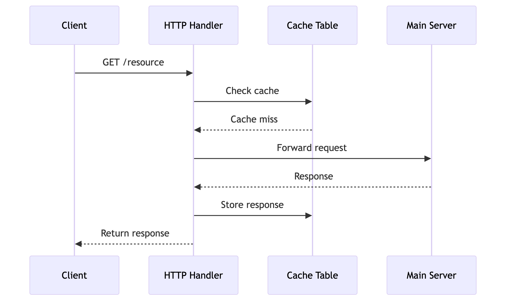

# LiteCDN

[![Python][python-badge]][python-url]
[![License][license-badge]][license-url]

*👀 Lightweight caching layer for fast and efficient content delivery*

## Overview

**LiteCDN** is a lightweight, extensible caching system that emulates core CDN functionality. Supports TTL-based expiration, LRU eviction, and a RESTful HTTP API for cache interaction. Ideal for educational purposes, rapid prototyping, or microservice integration.



## Key Features

* **TTL-Based Expiration** — Automatically invalidates cache entries based on timeouts.
* **LRU Eviction Policy** — Removes least recently used entries when full.
* **HTTP-Aware Caching** — Differentiates entries by HTTP method and path.
* **RESTful API Interface** — Built with FastAPI for managing cache operations.
* **Simulated Origin Server** — Mock backend replicates real HTTP responses.
* **Test Coverage** — `pytest` ensures reliability and correctness.
* **Modular Design** — Separation of caching logic and API layers for easy extension.

## Project Structure

```bash
.
├── app.py             # FastAPI server exposing cache API endpoints
├── cache.py           # Core cache logic (TTL, LRU, key management)
├── main_server.py     # Simulated backend origin server
├── test.py            # Unit tests
├── test.sh            # Shell script to run tests
├── requirements.txt   # Dependencies
└── figure/            # Diagrams and visuals
```

## Setup & Installation

```bash
# Create and activate virtual environment
python3 -m venv env
source env/bin/activate   # macOS/Linux
.\env\Scripts\activate  # Windows

# Install dependencies
pip install -r requirements.txt
```

## Running the Application

```bash
# Launch backend server
uvicorn main_server:server --port 8000

# Launch cache API server
uvicorn app:app --port 8080
```

## Running Tests

```bash
pytest test.py -v
./test.sh
```

## Contributing

All contributions are welcome! Please review [Issues](#) or submit a [Pull Request](#).

---

[python-badge]: https://img.shields.io/badge/Python-3776AB?style=flat&logo=python&logoColor=white
[python-url]: https://www.python.org/
[license-badge]: https://img.shields.io/badge/license-MIT-green
[license-url]: https://opensource.org/licenses/MIT
